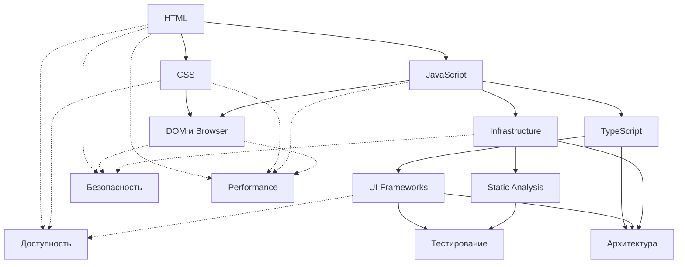

# Frontend: путь роста

Русскоязычная база знаний для тех, кто входит во frontend, закрывает пробелы в базе и растет до сильной инженерной практики.

Это не готовая энциклопедия и не витрина внутренних методологий. Репозиторий наполняется как публичный learning path: сначала уроки, затем задачи и полезные материалы по доменам. Поэтому статусы ниже показывают не только наличие домена, но и реальное состояние его слоев.

## Что внутри домена

Каждый домен по возможности собирается из трех частей:

1. `Уроки` — основной маршрут по теме.
2. `Задачи` — практика для закрепления.
3. `Материалы` — справочные ссылки на документацию, статьи и видео.

Сейчас лучше всего собран слой уроков. Задачи и отдельные справочные подборки будут добавляться поэтапно.

## Как читать статусы

### Статус домена

- `✅ Готов` — домен уже работает как учебный маршрут.
- `🟡 Частично готов` — часть маршрута уже полезна, но покрытие еще неровное.
- `⚪ Каркас` — домен обозначен, но полноценный маршрут еще не собран.

### Статус уроков, задач и материалов

- `✅ Готовы` — слой оформлен и им уже можно пользоваться.
- `🟡 Частично готовы` — слой есть, но покрыт неравномерно.
- `⚪ В подготовке` — отдельный публичный слой еще не собран.

Статус `Материалы` считается по разделам `Полезные материалы` внутри уроков:

- если подборки есть и в них уже есть ссылки на видео, статус `✅ Готовы`;
- если подборки есть, но без видео, статус `🟡 Частично готовы`;
- если подборок нет, статус `⚪ В подготовке`.

## Как использовать базу

### Если ты начинаешь с нуля

1. [HTML](./01-html/README.md)
2. [CSS](./02-css/README.md)
3. [JavaScript](./03-javascript/README.md)
4. [DOM и Browser](./04-dom-и-browser/README.md)
5. [TypeScript](./05-typescript/README.md)

### Если база уже есть

1. [UI Frameworks](./06-ui-frameworks/README.md)
2. [Infrastructure](./07-infrastructure/README.md)
3. [Static Analysis](./08-static-analysis/README.md)
4. [Тестирование](./09-тестирование/README.md)
5. [Архитектура](./10-архитектура/README.md)

### Карта маршрута

Быстрый обзор зависимости доменов:

### Главное правило

- Не считай тему закрытой, если ты только прочитал урок.
- Если плавает база, не прыгай сразу в сложные инженерные домены.
- Смотри на статус подслоев: готовый домен не означает, что в нем уже готовы задачи и материалы.

## Статус доменов

| Домен | Статус домена | Уроки | Задачи | Материалы |
|---|---|---|---|---|
| [HTML](./01-html/README.md) | ✅ Готов | ✅ Готовы | ⚪ В подготовке | ✅ Готовы |
| [CSS](./02-css/README.md) | ✅ Готов | ✅ Готовы | ⚪ В подготовке | 🟡 Частично готовы |
| [JavaScript](./03-javascript/README.md) | ✅ Готов | ✅ Готовы | ⚪ В подготовке | 🟡 Частично готовы |
| [DOM и Browser](./04-dom-и-browser/README.md) | ✅ Готов | ✅ Готовы | ⚪ В подготовке | 🟡 Частично готовы |
| [TypeScript](./05-typescript/README.md) | ✅ Готов | ✅ Готовы | ⚪ В подготовке | 🟡 Частично готовы |
| [UI Frameworks](./06-ui-frameworks/README.md) | 🟡 Частично готов | 🟡 Частично готовы | ⚪ В подготовке | 🟡 Частично готовы |
| [Infrastructure](./07-infrastructure/README.md) | ✅ Готов | ✅ Готовы | ⚪ В подготовке | 🟡 Частично готовы |
| [Static Analysis](./08-static-analysis/README.md) | ✅ Готов | ✅ Готовы | ⚪ В подготовке | 🟡 Частично готовы |
| [Тестирование](./09-тестирование/README.md) | 🟡 Частично готов | 🟡 Частично готовы | ⚪ В подготовке | 🟡 Частично готовы |
| [Архитектура](./10-архитектура/README.md) | ⚪ Каркас | 🟡 Частично готовы | ⚪ В подготовке | ⚪ В подготовке |
| [Безопасность](./11-безопасность/README.md) | ⚪ Каркас | 🟡 Частично готовы | ⚪ В подготовке | ⚪ В подготовке |
| [Доступность](./12-доступность/README.md) | ⚪ Каркас | 🟡 Частично готовы | ⚪ В подготовке | ⚪ В подготовке |
| [Performance](./13-performance/README.md) | ⚪ Каркас | 🟡 Частично готовы | ⚪ В подготовке | ⚪ В подготовке |
| [Soft Skills](./14-soft-skills/README.md) | 🟡 Частично готов | 🟡 Частично готовы | ⚪ В подготовке | ⚪ В подготовке |

## Что уже можно использовать

- Web-core домены уже собраны как последовательный маршрут по урокам.
- `Infrastructure` и `Static Analysis` тоже можно проходить как рабочие инженерные треки.
- `UI Frameworks`, `Тестирование` и `Soft Skills` уже содержат полезный материал, но пока не дают ровного покрытия по всему домену.
- Домены `Архитектура`, `Безопасность`, `Доступность` и `Performance` пока лучше читать как каркас и стартовую опору, а не как завершенный маршрут.

## Внешние источники

Когда в доменах появится отдельный слой материалов, базовыми источниками для него будут:

- MDN
- Doka
- официальная документация платформ и инструментов
- статьи и видео, которые реально помогают закрепить тему, а не дублируют урок

README описывает только публичную часть репозитория. Если внутри проекта есть служебные файлы, генерация или рабочая методология, они не считаются частью публичного обещания.
