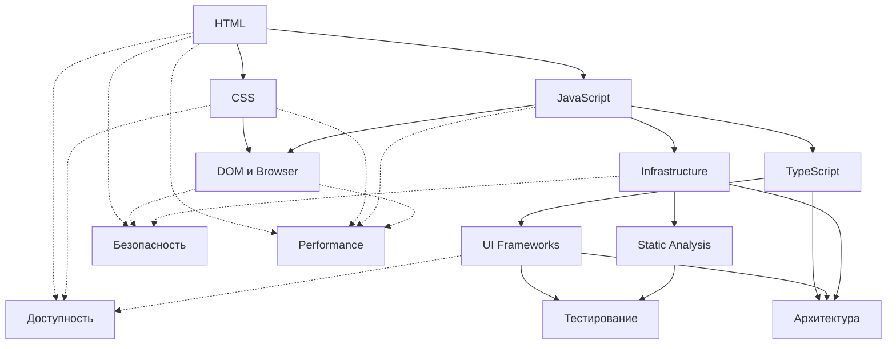

# База знаний Frontend: от новичка до senior инженера

Привет! 👋

Если ты входишь во frontend с нуля или хочешь закрыть дыры в базе, этот репозиторий поможет пройти путь от HTML, CSS и JavaScript до TypeScript, тестирования, инфраструктуры и архитектуры.

Здесь не нужно читать все подряд. Смотри на свой текущий уровень, выбирай ближайший маршрут и проходи темы последовательно там, где база действительно важна.

Не бойся, если что-то не будет понятно сразу, это нормально. Эту базу можно использовать как самостоятельный обучаяст, а можно — как опору рядом с курсом, ментором или рабочей практикой. Тут я буду отталкиваться от своего опыта и того, что практиковал, возможно, даже будут "фишки", которых нет нигде 😉

Я постарался орагнизовать все так, чтобы ты в первую очередь знал, куда тебе подсмотреть и есть перекрестные ссылки между уроками. Это сделано потому, что много знаний и навыков связаны между собой и периодически возрващаться назад или иногда подсматривать вперед - это нормально.

## С чего начать

### Если ты начинаешь с нуля

1. [HTML](./01-html/README.md)
2. [CSS](./02-css/README.md)
3. [JavaScript](./03-javascript/README.md)
4. [DOM и Browser](./04-dom-и-browser/README.md)
5. [TypeScript](./05-typescript/README.md)

### Если ты уже пишешь интерфейсы и хочешь собрать сильную базу

1. [UI Frameworks](./06-ui-frameworks/README.md)
2. [Infrastructure](./07-infrastructure/README.md)
3. [Static Analysis](./08-static-analysis/README.md)
4. [Тестирование](./09-тестирование/README.md)
5. [Архитектура](./10-архитектура/README.md)

### Если тебе нужно закрыть инженерные пробелы точечно

- [Безопасность](./11-безопасность/README.md)
- [Доступность](./12-доступность/README.md)
- [Performance](./13-performance/README.md)
- [Soft Skills](./14-soft-skills/README.md)

## Карта маршрута

Быстрый обзор того, как темы связаны между собой:

## Как устроена база

В каждом домене по возможности есть три части:

1. `Уроки` — чтобы собрать тему по порядку.
2. `Задачи` — чтобы проверить, что тема не осталась на уровне чтения.
3. `Материалы` — документация, статьи и видео для углубления.

Сейчас лучше всего готовы именно уроки. Задачи и отдельные подборки материалов добираются постепенно.

## Что уже можно проходить прямо сейчас

- `HTML`, `CSS`, `JavaScript`, `DOM и Browser` и `TypeScript` уже собраны в последовательный web-core маршрут.
- `Infrastructure` и `Static Analysis` тоже можно проходить как рабочие инженерные треки.
- `UI Frameworks`, `Тестирование` и `Soft Skills` уже полезны, но покрытие внутри домена пока неровное.
- `Архитектура`, `Безопасность`, `Доступность` и `Performance` пока лучше использовать как каркас и стартовую опору, а не как полностью закрытый маршрут.

## Главное правило

- Не считай тему закрытой, если ты только прочитал урок.
- Если плавает база, не прыгай сразу в сложные инженерные домены.
- Смотри на статус задач и материалов: готовый домен не означает, что внутри уже готовы и практика, и дополнительные источники.

## Как читать статусы

- `✅ Готов` — домен уже работает как учебный маршрут.
- `🟡 Частично готов` — часть маршрута уже полезна, но покрытие еще неровное.
- `⚪ Каркас` — домен обозначен, но полноценный маршрут еще не собран.
- `✅ Готовы` / `🟡 Частично готовы` / `⚪ В подготовке` — состояние уроков, задач и материалов внутри домена.

Для `Материалов` статус считается по разделам `Полезные материалы` внутри уроков: если подборки уже есть, но без видео, это `🟡 Частично готовы`; если есть и ссылки, и видео, это `✅ Готовы`.

## Статус доменов

| Домен | Статус домена | Уроки | Задачи | Материалы |
|---|---|---|---|---|
| [HTML](./01-html/README.md) | ✅ Готов | ✅ Готовы | ⚪ В подготовке | ✅ Готовы |
| [CSS](./02-css/README.md) | ✅ Готов | ✅ Готовы | ⚪ В подготовке | 🟡 Частично готовы |
| [JavaScript](./03-javascript/README.md) | ✅ Готов | ✅ Готовы | ⚪ В подготовке | 🟡 Частично готовы |
| [DOM и Browser](./04-dom-и-browser/README.md) | ✅ Готов | ✅ Готовы | ⚪ В подготовке | 🟡 Частично готовы |
| [TypeScript](./05-typescript/README.md) | ✅ Готов | ✅ Готовы | ⚪ В подготовке | 🟡 Частично готовы |
| [UI Frameworks](./06-ui-frameworks/README.md) | 🟡 Частично готов | 🟡 Частично готовы | ⚪ В подготовке | 🟡 Частично готовы |
| [Infrastructure](./07-infrastructure/README.md) | ✅ Готов | ✅ Готовы | ⚪ В подготовке | 🟡 Частично готовы |
| [Static Analysis](./08-static-analysis/README.md) | ✅ Готов | ✅ Готовы | ⚪ В подготовке | 🟡 Частично готовы |
| [Тестирование](./09-тестирование/README.md) | 🟡 Частично готов | 🟡 Частично готовы | ⚪ В подготовке | 🟡 Частично готовы |
| [Архитектура](./10-архитектура/README.md) | ⚪ Каркас | 🟡 Частично готовы | ⚪ В подготовке | ⚪ В подготовке |
| [Безопасность](./11-безопасность/README.md) | ⚪ Каркас | 🟡 Частично готовы | ⚪ В подготовке | ⚪ В подготовке |
| [Доступность](./12-доступность/README.md) | ⚪ Каркас | 🟡 Частично готовы | ⚪ В подготовке | ⚪ В подготовке |
| [Performance](./13-performance/README.md) | ⚪ Каркас | 🟡 Частично готовы | ⚪ В подготовке | ⚪ В подготовке |
| [Soft Skills](./14-soft-skills/README.md) | 🟡 Частично готов | 🟡 Частично готовы | ⚪ В подготовке | ⚪ В подготовке |

## Внешние источники

Когда в доменах появится отдельный слой материалов, базовыми источниками для него будут:

- MDN
- Doka
- официальная документация платформ и инструментов
- статьи и видео, которые реально помогают закрепить тему, а не дублируют урок

Ориентируйся в первую очередь на этот README и README доменов: именно они показывают, чем уже можно пользоваться как учебным маршрутом.
